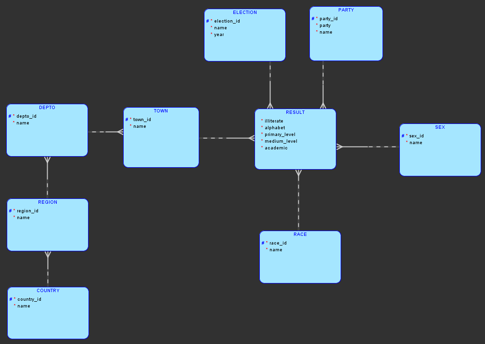
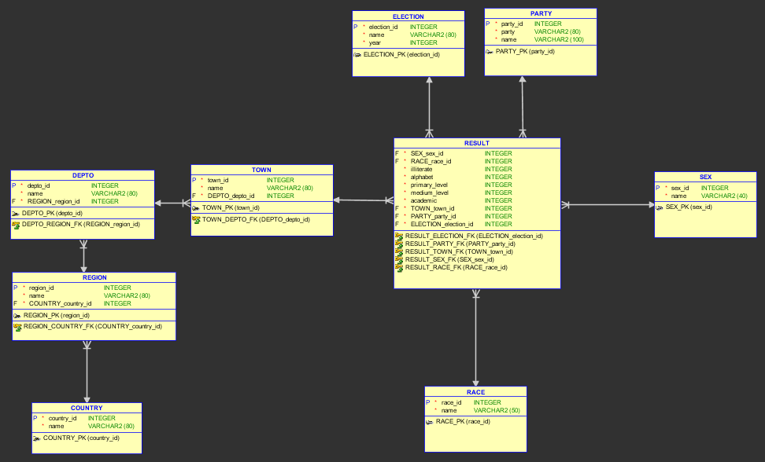

### Universidad de San Carlos de Guatemala

### Facultad de Ingeniería

### Escuela de Ciencias y Sistemas

## Documentación 

    

        
  

 

    <table>
        <tr>
            <th>Nombre</th>
            <th>Carnet</th>
        </tr>
        <tr>
            <th>Cristian Alexander Gómez Guzmán</th>
            <th>201801480</th>
        </tr>
    </table>

 

## **Índice**   
1. [Modelo](#id1)
2. [Normalización](#id2)

    

        
  

    

        
  

# Normalización 

| NOMBRE_ELECCION        | AÑO_ELECCION | PAIS        | REGION   | DEPTO               | MUNICIPIO              | PARTIDO | NOMBRE_PARTIDO              | SEXO    | RAZA      | ANALFABETOS | ALFABETOS | SEXO    | RAZA      | PRIMARIA | NIVEL MEDIO | UNIVERSITARIOS  |
|------------------------|--------------|-------------|----------|---------------------|------------------------|---------|-----------------------------|---------|-----------|-------------|-----------|---------|-----------|----------|-------------|-----------------|
| Elecciones Municipales | 2005         | EL SALVADOR | REGION 1 | Cabañas             | Sensuntepeque          | ARENA   | Alianza Nac. Rep.           | hombres | INDIGENAS | 2298        | 4800      | hombres | INDIGENAS | 1471     | 450         | 2879            |
| Elecciones Municipales | 2005         | EL SALVADOR | REGION 2 | Chalatenango        | Chalatenango           | ARENA   | Alianza Nac. Rep.           | hombres | INDIGENAS | 904         | 2996      | hombres | INDIGENAS | 2060     | 693         | 243             |
| Elecciones Municipales | 2001         | Nicaragua   | REGION 2 | Madriz              | Palacaguina            | PSN     | Partido Socialista Nic.     | mujeres | INDIGENAS | 2101        | 1731      | mujeres | INDIGENAS | 221      | 1195        | 315             |
| Elecciones Municipales | 2001         | Nicaragua   | REGION 4 | Rivas               | Rivas                  | PSN     | Partido Socialista Nic.     | mujeres | INDIGENAS | 1859        | 5072      | mujeres | INDIGENAS | 2047     | 943         | 2082            |
| Elecciones Municipales | 2001         | HONDURAS    | REGION 2 | Francisco Morazán   | Nueva Armenia          | PHT     | Partido Hondureño del trab. | mujeres | INDIGENAS | 2464        | 5933      | mujeres | INDIGENAS | 2565     | 438         | 2930            |
| Elecciones Municipales | 2005         | GUATEMALA   | Región 6 | Solola              | Santa María Visitación | PUG     | Partido Union Por Guat.     | mujeres | INDIGENAS | 2508        | 2773      | mujeres | INDIGENAS | 1810     | 654         | 309             |

# Primera forma normal

## Una relación esta en 1FN si y solo si todos los dominios simples subyacentes contienen solo valores atómicos.

## Se asigno un id a la tabla de resultado

| RESULTADO    |         |           |             |           |          |             |                 |
|--------------|---------|-----------|-------------|-----------|----------|-------------|-----------------|
| ID_RESULTADO | SEXO    | RAZA      | ANALFABETOS | ALFABETOS | PRIMARIA | NIVEL MEDIO | UNIVERSITARIOS  |
| 1            | hombres | INDIGENAS | 2298        | 4800      | 1471     | 450         | 2879            |
| 2            | hombres | INDIGENAS | 904         | 2996      | 2060     | 693         | 243             |
| 3            | mujeres | INDIGENAS | 2101        | 1731      | 221      | 1195        | 315             |
| 4            | mujeres | INDIGENAS | 1859        | 5072      | 2047     | 943         | 2082            |
| 5            | mujeres | INDIGENAS | 2464        | 5933      | 2565     | 438         | 2930            |
| 6            | mujeres | INDIGENAS | 2508        | 2773      | 1810     | 654         | 309             |

## Se separo a una tabla nombre y el año de elección.

| **ID_RESULTADO** | **NOMBRE_ELECCION**    | **AÑO_ELECCION**  |
|------------------|------------------------|-------------------|
| 1                | Elecciones Municipales | 2005              |
| 2                | Elecciones Municipales | 2005              |
| 3                | Elecciones Municipales | 2001              |
| 4                | Elecciones Municipales | 2001              |
| 5                | Elecciones Municipales | 2001              |
| 6                | Elecciones Municipales | 2005              |

| **ID_RESULTADO** | **PARTIDO** | **NOMBRE_PARTIDO**           |
|------------------|-------------|------------------------------|
| 1                | ARENA       | Alianza Nac. Rep.            |
| 2                | ARENA       | Alianza Nac. Rep.            |
| 3                | PSN         | Partido Socialista Nic.      |
| 4                | PSN         | Partido Socialista Nic.      |
| 5                | PHT         | Partido Hondureño del trab.  |
| 6                | PUG         | Partido Union Por Guat.      |

## De igual forma se creo la relacion entre pais, region, departamento y municipio.

| **PAIS** |              |
|----------|--------------|
| PAIS_ID  | PAIS         |
| 1        | EL SALVADOR  |
| 2        | Nicaragua    |
| 3        | HONDURAS     |
| 4        | GUATEMALA    |
|          |              |

| **REGION** |          |          |
|------------|----------|----------|
| REGION_ID  | REGION   | PAIS_ID  |
| 1          | REGION 1 | 1        |
| 2          | REGION 2 | 1        |
| 3          | REGION 3 | 2        |
| 4          | REGION 4 | 2        |
| 5          | REGION 5 | 3        |

| **DEPTO** |                     |            |
|-----------|---------------------|------------|
| DEPTO_ID  | DEPTO               | REGION_ID  |
| 1         | Cabañas             | 1          |
| 2         | Chalatenango        | 2          |
| 3         | Madriz              | 3          |
| 4         | Rivas               | 4          |
| 5         | Francisco Morazán   | 5          |

| **MUNICIPIO** |               |           |
|---------------|---------------|-----------|
| MUNICIPIO_ID  | MUNICIPIO     | DEPTO_ID  |
| 1             | Sensuntepeque | 1         |
| 2             | Chalatenango  | 2         |
| 3             | Palacaguina   | 3         |
| 4             | Rivas         | 4         |
| 5             | Nueva Armenia | 5         |

# Segunda forma normal
## Una relación esta en 2FN si y solo si está en 1FN y todos los atributos no clave dependen por completo de la llave primaria.

| **RESULTADO** |          |           |             |           |          |             |                |             |              |             |
|---------------|----------|-----------|-------------|-----------|----------|-------------|----------------|-------------|--------------|-------------|
| ID_RESULTADO  | SEXO     | RAZA      | ANALFABETOS | ALFABETOS | PRIMARIA | NIVEL MEDIO | UNIVERSITARIOS | ID_ELECCION | ID_MUNICIPIO | ID PARTIDO  |
| 1             | hombres  | INDIGENAS | 2298        | 4800      | 1471     | 450         | 2879           | 1           | 1            | 1           |
| 2             | hombres  | INDIGENAS | 904         | 2996      | 2060     | 693         | 243            | 1           | 2            | 1           |
| 3             | mujeres  | INDIGENAS | 2101        | 1731      | 221      | 1195        | 315            | 2           | 3            | 2           |
| 4             | mujeres  | INDIGENAS | 1859        | 5072      | 2047     | 943         | 2082           | 2           | 4            | 2           |
| 5             | mujeres  | INDIGENAS | 2464        | 5933      | 2565     | 438         | 2930           | 2           | 5            | 2           |
| 6             | mujeres  | INDIGENAS | 2508        | 2773      | 1810     | 654         | 309            | 1           | 6            | 1           |

| **ELECCION** |                        |               |
|--------------|------------------------|---------------|
| ID_ELECCION  | NOMBRE_ELECCION        | AÑO_ELECCION  |
| 1            | Elecciones Municipales | 2005          |
| 2            | Elecciones Municipales | 2001          |

| **PARTIDO** |          |                              |
|-------------|----------|------------------------------|
| ID_PARTIDO  | PARTIDO  | NOMBRE_PARTIDO               |
| 1           | ARENA    | Alianza Nac. Rep.            |
| 2           | PSN      | Partido Socialista Nic.      |
| 3           | PHT      | Partido Hondureño del trab.  |
| 4           | PUG      | Partido Union Por Guat.      |

| **PAIS** |              |
|----------|--------------|
| PAIS_ID  | PAIS         |
| 1        | EL SALVADOR  |
| 2        | Nicaragua    |
| 3        | HONDURAS     |
| 4        | GUATEMALA    |

| **REGION** |          |          |
|------------|----------|----------|
| REGION_ID  | REGION   | PAIS_ID  |
| 1          | REGION 1 | 1        |
| 2          | REGION 2 | 1        |
| 3          | REGION 3 | 2        |
| 4          | REGION 4 | 2        |
| 5          | REGION 5 | 3        |
| 6          | Región 6 | 4        |

| **DEPTO** |                     |            |
|-----------|---------------------|------------|
| DEPTO_ID  | DEPTO               | REGION_ID  |
| 1         | Cabañas             | 1          |
| 2         | Chalatenango        | 2          |
| 3         | Madriz              | 3          |
| 4         | Rivas               | 4          |
| 5         | Francisco Morazán   | 5          |
| 6         | Solola              | 6          |

| **MUNICIPIO** |                        |           |
|---------------|------------------------|-----------|
| MUNICIPIO_ID  | MUNICIPIO              | DEPTO_ID  |
| 1             | Sensuntepeque          | 1         |
| 2             | Chalatenango           | 2         |
| 3             | Palacaguina            | 3         |
| 4             | Rivas                  | 4         |
| 5             | Nueva Armenia          | 5         |
| 6             | Santa María Visitación | 6         |

# Tercera forma normal
## Una relación esta en 3FN si y solo si está en 2FN y todos los atributos no clave dependen de manera no transitiva de la clave primaria.

| **RESULTADO** |             |           |          |             |                |          |          |             |              |             |
|---------------|-------------|-----------|----------|-------------|----------------|----------|----------|-------------|--------------|-------------|
| ID_RESULTADO  | ANALFABETOS | ALFABETOS | PRIMARIA | NIVEL MEDIO | UNIVERSITARIOS | ID_SEXO  | ID_RAZA  | ID_ELECCION | ID_MUNICIPIO | ID PARTIDO  |
| 1             | 2298        | 4800      | 1471     | 450         | 2879           | 1        | 1        | 1           | 1            | 1           |
| 2             | 904         | 2996      | 2060     | 693         | 243            | 1        | 1        | 1           | 2            | 1           |
| 3             | 2101        | 1731      | 221      | 1195        | 315            | 2        | 1        | 2           | 3            | 2           |
| 4             | 1859        | 5072      | 2047     | 943         | 2082           | 2        | 1        | 2           | 4            | 2           |
| 5             | 2464        | 5933      | 2565     | 438         | 2930           | 2        | 1        | 2           | 5            | 3           |
| 6             | 2508        | 2773      | 1810     | 654         | 309            | 2        | 1        | 1           | 6            | 4           |

## Se separo en una tabla los datos de raza y sexo.

| **ELECCION** |                        |               |
|--------------|------------------------|---------------|
| ID_ELECCION  | NOMBRE_ELECCION        | AÑO_ELECCION  |
| 1            | Elecciones Municipales | 2005          |
| 2            | Elecciones Municipales | 2001          |
|              |                        |               |

| **PARTIDO** |          |                              |
|-------------|----------|------------------------------|
| ID_PARTIDO  | PARTIDO  | NOMBRE_PARTIDO               |
| 1           | ARENA    | Alianza Nac. Rep.            |
| 2           | PSN      | Partido Socialista Nic.      |
| 3           | PHT      | Partido Hondureño del trab.  |
| 4           | PUG      | Partido Union Por Guat.      |
|             |          |                              |

| **PAIS** |              |
|----------|--------------|
| PAIS_ID  | PAIS         |
| 1        | EL SALVADOR  |
| 2        | Nicaragua    |
| 3        | HONDURAS     |
| 4        | GUATEMALA    |
|          |              |

| **REGION** |          |          |
|------------|----------|----------|
| REGION_ID  | REGION   | PAIS_ID  |
| 1          | REGION 1 | 1        |
| 2          | REGION 2 | 1        |
| 3          | REGION 3 | 2        |
| 4          | REGION 4 | 2        |
| 5          | REGION 5 | 3        |
| 6          | Región 6 | 4        |
|            |          |          |

| **DEPTO** |                     |            |
|-----------|---------------------|------------|
| DEPTO_ID  | DEPTO               | REGION_ID  |
| 1         | Cabañas             | 1          |
| 2         | Chalatenango        | 2          |
| 3         | Madriz              | 3          |
| 4         | Rivas               | 4          |
| 5         | Francisco Morazán   | 5          |
| 6         | Solola              | 6          |
|           |                     |            |

| **MUNICIPIO** |                        |           |
|---------------|------------------------|-----------|
| MUNICIPIO_ID  | MUNICIPIO              | DEPTO_ID  |
| 1             | Sensuntepeque          | 1         |
| 2             | Chalatenango           | 2         |
| 3             | Palacaguina            | 3         |
| 4             | Rivas                  | 4         |
| 5             | Nueva Armenia          | 5         |
| 6             | Santa María Visitación | 6         |
|               |                        |           |

| **SEXO** |          |
|----------|----------|
| ID_SEXO  | SEXO     |
| 1        | hombres  |
| 2        | mujeres  |
|          |          |

| **RAZA** |            |
|----------|------------|
| ID_RAZA  | RAZA       |
| 1        | INDIGENAS  |
|          |            |

# Restricciones para utilizar
### TOWN, DEPTO, REGION, COUNTRY, ELECTION, PARTY el atributo name de cada una de las tablas solo acepta 80 carácteres.
### SEX el atributo name solo acepta 40 carácteres.
### RACE el atributo name solo acepta 50 carácteres.

# Consideraciones a utilizar

### La entidad RESULT el atributo town_od hace referencia a la llave primaria de TOWN, el atributo party_id hace referencia a la llave primaria de PARTY el atributo election_id hace referencia a la llave primaria de ELECTION.
